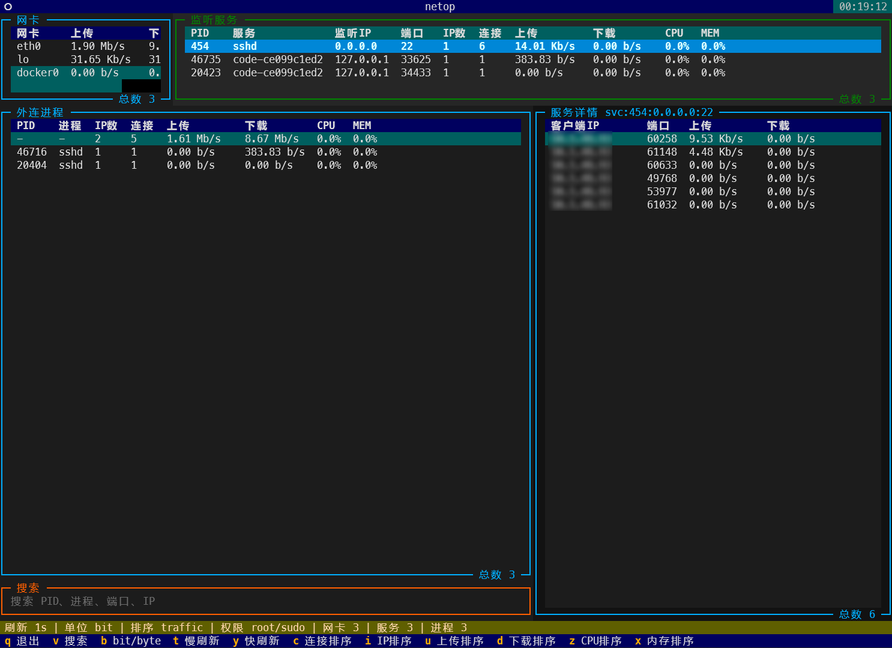

------

# netop

[中文说明](README-CN.md)

`netop` is a focused rewrite of the original `tmd-top` idea for day-to-day
Linux network troubleshooting. The upstream project has not seen active feature
work for a while, and its original design bundled GeoIP lookup, SQLite snapshot
tables, firewall mutation, and TUI rendering into one application. This fork
intentionally narrows the scope to one job: fast, read-only terminal network
monitoring.



## Design Goals

- Pure monitoring: no IP ban button, no iptables, nftables, or firewalld writes.
- Stateless runtime: no SQLite database and no persistent traffic history.
- No GeoIP: no bundled MMDB file, no location column, no per-IP lookup cost.
- Low overhead: collect from `ss`, `ps`, and `/proc/net/dev`, then calculate
  rates from in-memory deltas.
- Modern Textual path: use public Textual APIs and track `textual>=8.2,<9`
  instead of pinning to `textual==1.0.0`.

## Current Status

This is an early refactor branch. The package and CLI entry point have been
renamed to `netop`. Compatibility with the old `tmd` and `tmd-top` command
names is intentionally not preserved.

The UI currently shows:

- interface traffic
- listening services
- outbound processes
- per-service or per-process TCP connection details
- search, refresh mode, sort mode, permission state, and rate unit state

## Requirements

- Python >= 3.10
- Linux
- `iproute2` for `ss`
- `procps` for `ps`

## Install From Source

```shell
python -m pip install -e .
```

## Usage

```shell
netop
```

Run with elevated privileges when possible if you need complete PID/process
ownership data:

```shell
sudo netop
```

When started as a normal user, `netop` will try `sudo -n ss` if passwordless
sudo is available. It never prompts for a sudo password inside the TUI.

## Shortcuts

| Key | Action |
| --- | --- |
| `q` | Quit |
| `v` | Focus search |
| `b` | Toggle bit/byte rate mode |
| `t` | Slow refresh to 5 seconds |
| `y` | Restore refresh to 1 second |
| `r` | Sort by total traffic |
| `c` | Sort by connections |
| `i` | Sort by unique IP count |
| `u` | Sort by upload |
| `d` | Sort by download |
| `z` | Sort by CPU |
| `x` | Sort by memory |

Click or highlight a listening service or outbound process row to display its
connection details on the right.

## Display Units

By default, `netop` displays network rates as bit rates such as `Kb/s` and
`Mb/s`. Press `b` to switch to byte-rate mode such as `KB/s` and `MB/s`.

## Data Flow

1. `ss -tniH state established` reads TCP socket counters.
2. `ss -tpanH` reads listening sockets, established sockets, PIDs, and process
   names when available.
3. `ps` provides lightweight CPU and memory metadata by PID.
4. `/proc/net/dev` provides interface-level counters.
5. The collector computes deltas in memory and sends immutable snapshots to the
   Textual UI.

## What Changed From `tmd-top`

| Area | `netop` direction |
| --- | --- |
| GeoIP | Removed |
| SQLite | Removed |
| Firewall ban actions | Removed |
| Package name | `netop` |
| CLI command | `netop` only |
| Textual dependency | `textual>=8.2,<9` |
| Runtime model | Read-only, in-memory snapshots |

## Original Project

Original repository README: https://github.com/CDWEN0526/tmd-top
